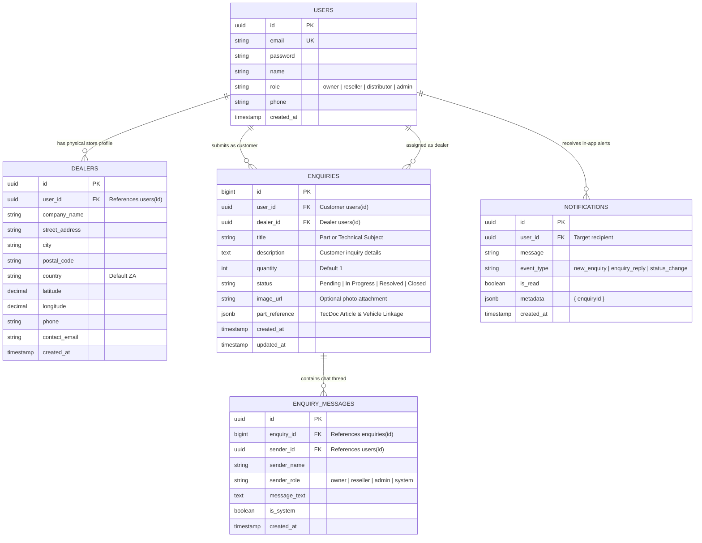
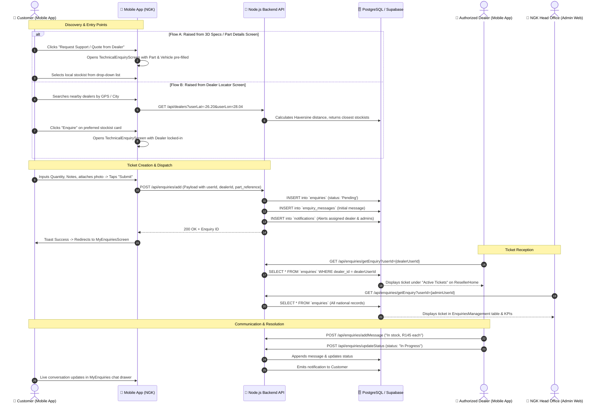

# 📋 NGK Dealer, Reseller & Technical Enquiry Management System
### Complete Technical Specification, Data Flow & System Architecture

---

## 1. Executive Summary & System Objectives
The **Dealer & Enquiry Management System** is the core commercial bridge in the NGK Automotive Ecosystem. It connects retail vehicle owners and mechanics directly with local authorized stockists, regional distributors, and NGK technical head-office engineers.

### Core Objectives:
1. **Zero-Friction Parts Inquiry**: Transition customers directly from TecDoc Pegasus OE fitment search into an active quote or technical ticket.
2. **Geospatial Stockist Discovery**: Route customers to the nearest physical stockist based on real-time GPS distance calculation.
3. **Multi-Tier Ticket Lifecycle**: Facilitate structured two-way conversations between customers and dealers with status tracking (`Pending` ➔ `In Progress` ➔ `Resolved` ➔ `Closed`).
4. **Unified Multi-Role Access**: Role-based access control ensuring owners only see their own tickets, dealers see tickets assigned to their store, and administrators maintain complete national visibility.

---

## 2. Multi-Role Hierarchy & Permissions

| Role Identifier | Primary Client Interface | Access Level & Scope |
| :--- | :--- | :--- |
| **`owner`** (Vehicle Owner / Mechanic) | Mobile App (React Native) | • Searches vehicles and parts via TecDoc.<br>• Locates nearby dealers/stockists.<br>• Creates technical enquiries and requests quotes.<br>• Views and replies to own tickets in `MyEnquiriesScreen`. |
| **`reseller`** (Authorized Dealer / Store) | Mobile App (`ResellerHome`) | • Listed in dealer directory with GPS coordinates.<br>• Receives tickets assigned to their store.<br>• Sends price/availability quotes and chats with customers.<br>• Updates ticket status (`In Progress`, `Resolved`). |
| **`distributor`** (Tier-1 Regional Hub) | Mobile App (`DistributorHomeScreen`) | • Oversees regional trade supply requests.<br>• High-volume stock distribution.<br>• Can monitor sub-dealer enquiries within their territory. |
| **`admin`** (NGK Head Office) | Web Portal (React + Vite) | • Global oversight over all national enquiries.<br>• Reassigns tickets between dealers.<br>• Direct chat with customers for technical escalation.<br>• Creates and verifies dealers/resellers in User Management. |

---

## 3. Database Schema (PostgreSQL / Supabase)



---

## 4. End-to-End System Data Flow



---

## 5. API Contracts & Endpoints Specification

### 1. Dealer Locator Service
* **Endpoint**: `GET /api/dealers`
* **Query Parameters**:
  * `userLat` (optional, float): Customer latitude.
  * `userLon` (optional, float): Customer longitude.
  * `searchQuery` (optional, string): Filter by store name, city, or street.
  * `role` (optional, string): Filter by `reseller` or `distributor`.
* **Backend Processing**:
  * Queries `public.dealers` joined with `public.users`.
  * Computes distance in kilometers using the Haversine formula:
    $$d = 2R \times \arcsin\left(\sqrt{\sin^2\left(\frac{\Delta\text{lat}}{2}\right) + \cos(\text{lat}_1)\cos(\text{lat}_2)\sin^2\left(\frac{\Delta\text{lon}}{2}\right)}\right)$$
  * Sorts records ascending by distance.
* **Response Structure**:
  ```json
  [
    {
      "id": "3fa85f64-5717-4562-b3fc-2c963f66afa6",
      "userId": "9b1deb4d-3b7d-4bad-9bdd-2b0d7b3dcb6d",
      "companyName": "Auto Spares Direct Johannesburg",
      "streetAddress": "124 Main Reef Road",
      "city": "Johannesburg",
      "postalCode": "2001",
      "phone": "+27 11 555 0192",
      "email": "jhb@autospares.co.za",
      "role": "reseller",
      "latitude": -26.204103,
      "longitude": 28.047305,
      "distance": "3.4 km"
    }
  ]
  ```

---

### 2. Submit Technical Enquiry
* **Endpoint**: `POST /api/enquiries/add`
* **Request Payload**:
  ```json
  {
    "userId": "d748f2b3-5718-40a2-b2cc-1f29583b27b3",
    "dealer": "9b1deb4d-3b7d-4bad-9bdd-2b0d7b3dcb6d",
    "dealerName": "Auto Spares Direct Johannesburg",
    "title": "ILKAR7C10 Laser Iridium Spark Plug (4x)",
    "description": "Please confirm compatibility with 2018 Toyota RAV4 2.0 and provide price.",
    "quantity": 4,
    "imageUrl": "https://ngkapi.ckrtechnologies.in/uploads/broken_plug.jpg",
    "vehicle": {
      "part": {
        "articleNo": "ILKAR7C10",
        "articleName": "Spark Plug",
        "brandName": "NGK"
      },
      "vehicle": {
        "typeName": "Toyota RAV4 IV (XA40) 2.0 4WD",
        "modelSeries": "RAV4 IV",
        "year": "2018"
      }
    }
  }
  ```
* **Success Response (200 OK)**:
  ```json
  {
    "success": true,
    "message": "Enquiry added successfully",
    "data": {
      "id": 1042,
      "user_id": "d748f2b3-5718-40a2-b2cc-1f29583b27b3",
      "dealer_id": "9b1deb4d-3b7d-4bad-9bdd-2b0d7b3dcb6d",
      "title": "ILKAR7C10 Laser Iridium Spark Plug (4x)",
      "status": "Pending",
      "created_at": "2026-09-03T12:30:00.000Z"
    }
  }
  ```

---

### 3. Fetch Enquiries with Role Partitioning
* **Endpoint**: `GET /api/enquiries/getEnquiry?userId={currentUserId}`
* **Role-Based Query Logic**:
  * **Customer (`role == 'owner'`)**: `WHERE user_id = currentUserId`
  * **Dealer (`role == 'reseller'`)**: `WHERE dealer_id = currentUserId`
  * **Admin / Distributor**: Unrestricted (`SELECT * FROM enquiries`)
* **Response Item**:
  ```json
  [
    {
      "id": 1042,
      "title": "ILKAR7C10 Laser Iridium Spark Plug (4x)",
      "description": "Please confirm compatibility with 2018 Toyota RAV4 2.0 and provide price.",
      "status": "In Progress",
      "quantity": 4,
      "userName": "John Doe",
      "userEmail": "johndoe@gmail.com",
      "dealerName": "Auto Spares Direct Johannesburg",
      "imageurl": "https://ngkapi.ckrtechnologies.in/uploads/broken_plug.jpg",
      "messages": [
        {
          "id": "e3a89...",
          "sender": "owner",
          "senderName": "John Doe",
          "text": "Please confirm compatibility with 2018 Toyota RAV4 2.0 and provide price.",
          "timestamp": "2026-09-03T12:30:00.000Z"
        },
        {
          "id": "f5c12...",
          "sender": "reseller",
          "senderName": "Auto Spares Direct",
          "text": "Hello John! Yes, ILKAR7C10 is the exact OEM spec. We have 8 in stock at R185 each.",
          "timestamp": "2026-09-03T12:34:20.000Z"
        }
      ]
    }
  ]
  ```

---

### 4. Ticket Status Update & Audit Trail
* **Endpoint**: `POST /api/enquiries/updateStatus`
* **Payload**:
  ```json
  {
    "id": 1042,
    "status": "Resolved",
    "responderName": "Auto Spares Direct",
    "role": "reseller"
  }
  ```
* **Side-effects**:
  1. Updates `enquiries.status = 'Resolved'`.
  2. Inserts an audit entry in `enquiry_messages`:
     `"Enquiry status updated to RESOLVED"` by `Auto Spares Direct`.
  3. Sends an in-app notification to the customer.

---

## 6. Screen-by-Screen Frontend Implementation

### 1. `DealerLocatorScreen.js` (Mobile App)
* **File**: `app/src/screens/DealerLocatorScreen.js`
* **Features**:
  * Real-time GPS location tracking with distance indicators (`3.4 km`).
  * Instant category toggle: `All` | `Distributors` | `Resellers`.
  * **WhatsApp Button**: Launches `Linking.openURL('whatsapp://send?phone=...')` for instant instant-messaging.
  * **Directions Button**: Launches Google Maps navigation with exact coordinates.
  * **Enquire Button**: Passes `{ dealerId, dealerName }` to pre-lock the dealer in `TechnicalEnquiryScreen`.

### 2. `VerifiedPartsScreen.js` (Mobile App)
* **File**: `app/src/screens/VerifiedPartsScreen.js`
* **Features**:
  * Shows 360° interactive turntable, HD photographic criteria, and OE cross-references.
  * **"Request Support / Quote from Dealer"** button: Automatically packages the full TecDoc article object and vehicle linkage into route params and opens `TechnicalEnquiryScreen`.

### 3. `TechnicalEnquiryScreen.js` (Mobile App)
* **File**: `app/src/screens/TechnicalEnquiryScreen.js`
* **Features**:
  * Smart context detection: If dealer was passed, it locks the dealer; if part was passed, it locks the part and offers a stockist picker.
  * Quantity increment/decrement selector.
  * Camera / gallery attachment using `react-native-image-picker` uploaded via `POST /api/upload`.
  * Full submission to `POST /api/enquiries/add`.

### 4. `MyEnquiriesScreen.js` (Mobile App)
* **File**: `app/src/screens/MyEnquiriesScreen.js`
* **Features**:
  * Status filter pills: `ALL` | `PENDING` | `IN PROGRESS` | `RESOLVED`.
  * Live conversation slide-up modal with chat bubbles.
  * Quick reply input bar connected to `POST /api/enquiries/addMessage`.

### 5. `EnquiriesManagement.jsx` (Web Admin Portal)
* **File**: `admin/src/pages/EnquiriesManagement.jsx`
* **Features**:
  * KPI summary cards: Total Enquiries, Pending Review, In Progress, Resolved Rate.
  * Global Search & Status Filter.
  * Slide-over drawer with customer profile, vehicle linkage, attached photos, and live chat thread.
  * Status management buttons: `Mark In Progress`, `Mark Resolved`, `Close Ticket`.
  * One-click export to CSV & PDF for management reporting.

---

## 7. Recommended Optimizations for High-Scale Operations

1. **Automatic Nearest-Dealer Assignment**:
   * If a customer raises an enquiry directly from a part specification without choosing a dealer, the system can automatically assign the ticket to the authorized stockist geographically closest to their GPS coordinates.
2. **WebSocket / Supabase Real-Time Subscriptions**:
   * Subscribe to `supabase.channel('enquiries')` so new chat replies and status updates appear instantly without pulling to refresh.
3. **SMS / WhatsApp Fallback Notification**:
   * Send an automated WhatsApp notification via Twilio / MessageBird when an inquiry is received by a stockist who hasn't opened the app within 30 minutes.
4. **Dealer Inventory Sync**:
   * Allow resellers to flag in-stock parts directly in their portal, enabling instantaneous automated quotes for customer enquiries.
