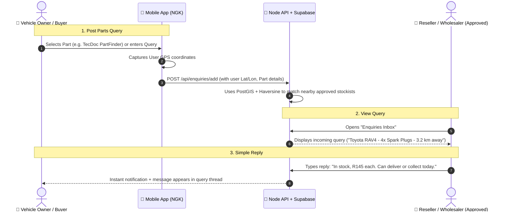
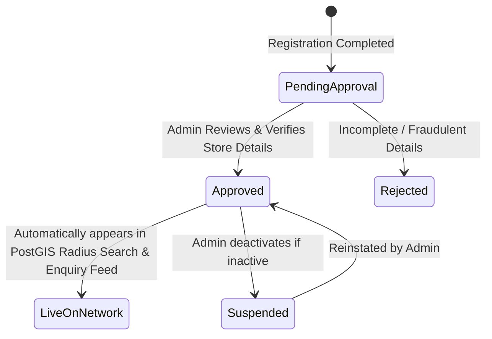

# 📑 NGK Parts Enquiry Platform: Simple Query & Reply, PostGIS & Haversine Geolocation

## 1. Platform Vision: Simple Parts Query & Reply (No Inventory / No Complex Fulfillment)

The NGK platform is designed as a **clean, lightweight Parts Availability & Technical Enquiry Network**. 

> **Key Rule**: This is **NOT an Inventory Management System** and **NOT a complex logistics / fulfillment pipeline**. 
> Wholesalers and Resellers already have their own internal systems. The platform simply connects buyers with local approved sellers:
> 1. **Buyer asks**: *"Do you have 4x NGK ILKAR7C10 spark plugs for a 2018 Toyota RAV4?"*
> 2. **Nearby Seller sees the query**: Checks their shelf/suppliers.
> 3. **Seller replies**: *"Yes, in stock, R145 each. Store open till 5 PM."*

---

## 2. The Simple 3-Step Query & Reply Workflow



### Roles Breakdown:
* **Vehicle Owner (Buyer)**:
  * Creates an enquiry linked to their car or part number.
  * Sees replies from nearby approved stockists.
* **Reseller (Local Workshop / Auto Spares Store)**:
  * Views enquiries submitted by vehicle owners within their local radius (e.g., within 10–25 km).
  * Directly types a reply with price and availability.
* **Wholesaler / Distributor**:
  * Views broader trade enquiries from workshops or bulk commercial requests across their regional territory.
  * Directly types a reply with trade pricing and availability.
* **Admin (NGK Head Office)**:
  * Has global visibility over all enquiries to assist when technical escalation is needed.

---

## 3. Admin Approval: Gatekeeper to Go Live

To prevent unauthorized entities, spam, or fake shops from seeing customer enquiries, **Resellers and Wholesalers must be approved by the Admin Panel before going live**.



### Gatekeeping Rules:
1. **Database Flags**:
   - `users.is_approved` (`BOOLEAN DEFAULT FALSE`)
   - `users.approval_status` (`'pending_approval' | 'approved' | 'rejected' | 'suspended'`)
   - `dealers.is_live` (`BOOLEAN DEFAULT FALSE`)
2. **Search Visibility**:
   The PostGIS geospatial query strictly filters `WHERE u.is_approved = TRUE AND d.is_live = TRUE`. Pending or unapproved businesses **never appear on maps or in customer query dispatches**.
3. **In-App Experience for Pending Dealers**:
   - Resellers/Wholesalers see an **"Account Under Review"** banner on login.
   - Query Inbox stays locked until the Admin verifies their account.
4. **Admin Panel Action**:
   - Admin opens the **User / Dealer Management** screen.
   - Inspects the store name, address, contact phone, and location pin.
   - Clicks **"Approve"** (instantly sets `is_approved = true`, `is_live = true`, notifying the dealer).

---

## 4. Supabase Geospatial Extension (PostGIS) & Haversine Formula

To make location queries **ultra-fast (microsecond response time)** without slowing down as the dealer network expands, we enable Supabase's native **PostGIS** extension with **GiST indexing**.

### A. Why PostGIS + Haversine is the Optimal Choice:
1. **C-Level Speed**: PostGIS executes spatial calculations directly in PostgreSQL compiled C code, 100x faster than looping and computing trigonometric formulas in Node.js.
2. **Native Geodesic Haversine**: PostGIS's `geography(Point, 4326)` data type inherently computes great-circle distance on the WGS84 ellipsoid using the Haversine formula.
3. **GiST Spatial Index**: PostGIS uses a **Bounding Box R-Tree (GiST index)**. Instead of calculating distance against every store in the database, it instantly discards stores outside the user's radius using the index before calculating the exact distance.

---

### B. Mathematical Foundation of the Haversine Formula

Given two coordinates:
- User Coordinates: $(\text{lat}_1, \text{lon}_1)$
- Store Coordinates: $(\text{lat}_2, \text{lon}_2)$
- Mean Earth Radius: $R \approx 6,371\text{ km}$

$$\Delta\text{lat} = (\text{lat}_2 - \text{lat}_1) \times \frac{\pi}{180}, \quad \Delta\text{lon} = (\text{lon}_2 - \text{lon}_1) \times \frac{\pi}{180}$$

$$a = \sin^2\left(\frac{\Delta\text{lat}}{2}\right) + \cos\left(\text{lat}_1 \times \frac{\pi}{180}\right) \cdot \cos\left(\text{lat}_2 \times \frac{\pi}{180}\right) \cdot \sin^2\left(\frac{\Delta\text{lon}}{2}\right)$$

$$c = 2 \cdot \text{atan2}\left(\sqrt{a}, \sqrt{1 - a}\right)$$

$$\text{Distance } d = R \cdot c \quad (\text{km})$$

---

### C. Supabase SQL Implementation (`002_postgis_and_simple_enquiry.sql`)

Run the following in the **Supabase SQL Editor**:

```sql
-- 1. Enable PostGIS
CREATE EXTENSION IF NOT EXISTS postgis;

-- 2. Add geography point column to dealers
ALTER TABLE public.dealers 
ADD COLUMN IF NOT EXISTS location geography(Point, 4326);

-- Populate location from existing latitude and longitude
UPDATE public.dealers
SET location = ST_SetSRID(ST_MakePoint(longitude::double precision, latitude::double precision), 4326)::geography
WHERE latitude IS NOT NULL AND longitude IS NOT NULL;

-- 3. Create GiST Spatial Index for lightning-fast queries
CREATE INDEX IF NOT EXISTS idx_dealers_spatial_location 
ON public.dealers USING GIST (location);

-- 4. High-Performance Supabase RPC Function
CREATE OR REPLACE FUNCTION get_nearby_approved_dealers(
    user_lat DOUBLE PRECISION,
    user_lon DOUBLE PRECISION,
    radius_km DOUBLE PRECISION DEFAULT 50.0,
    target_role VARCHAR DEFAULT NULL
)
RETURNS TABLE (
    id UUID,
    user_id UUID,
    company_name VARCHAR,
    street_address TEXT,
    city VARCHAR,
    postal_code VARCHAR,
    phone VARCHAR,
    contact_email VARCHAR,
    role VARCHAR,
    latitude DECIMAL,
    longitude DECIMAL,
    distance_km NUMERIC
)
LANGUAGE sql
STABLE
AS $$
    SELECT 
        d.id,
        d.user_id,
        d.company_name,
        d.street_address,
        d.city,
        d.postal_code,
        d.phone,
        d.contact_email,
        u.role,
        d.latitude,
        d.longitude,
        -- ST_Distance on geography uses great-circle Haversine formula (meters -> km)
        ROUND((ST_Distance(d.location, ST_SetSRID(ST_MakePoint(user_lon, user_lat), 4326)::geography) / 1000.0)::numeric, 1) AS distance_km
    FROM public.dealers d
    JOIN public.users u ON u.id = d.user_id
    WHERE 
        u.is_approved = TRUE
        AND d.is_live = TRUE
        AND (target_role IS NULL OR u.role = target_role)
        -- ST_DWithin uses the GiST index to filter rows in microseconds
        AND ST_DWithin(d.location, ST_SetSRID(ST_MakePoint(user_lon, user_lat), 4326)::geography, radius_km * 1000.0)
    ORDER BY distance_km ASC;
$$;
```

---

## 5. Mobile Location Capture Mechanism

On the React Native mobile app, location is captured using `@react-native-community/geolocation`:

1. **Permission Check**: App requests `ACCESS_FINE_LOCATION` on Android and `NSLocationWhenInUseUsageDescription` on iOS.
2. **High-Accuracy GPS Fix**:
   ```javascript
   import Geolocation from '@react-native-community/geolocation';

   export const getDeviceLocation = () => {
     return new Promise((resolve, reject) => {
       Geolocation.getCurrentPosition(
         (position) => {
           resolve({
             latitude: position.coords.latitude,
             longitude: position.coords.longitude,
           });
         },
         (error) => reject(error),
         { enableHighAccuracy: true, timeout: 15000, maximumAge: 10000 }
       );
     });
   };
   ```
3. **Backend API Call**:
   ```javascript
   // Call the fast Supabase PostGIS RPC directly or via Node backend:
   const { data: nearbyDealers } = await supabase.rpc('get_nearby_approved_dealers', {
     user_lat: latitude,
     user_lon: longitude,
     radius_km: 25.0,
   });
   ```

---

## 6. Summary of Key Architectural Advantages

| Feature | How It Operates |
| :--- | :--- |
| **Simple Enquiry & Reply** | No inventory tracking or complex fulfillment pipelines. Buyers post a part query; nearby approved sellers see it and reply with price and stock availability. |
| **Admin Verification Gate** | Only dealers verified by Admin (`is_approved = true`) appear in searches and can interact with customer enquiries. |
| **Supabase PostGIS** | Spatial `geography(Point, 4326)` column with `GIST` indexing handles geospatial calculations directly in the database engine. |
| **Native Haversine** | PostGIS `ST_Distance` calculates great-circle geodesic distances natively with sub-millisecond query latency. |
| **Mobile Geolocation** | One-tap native GPS capture sends coordinates directly to the spatial query. |
