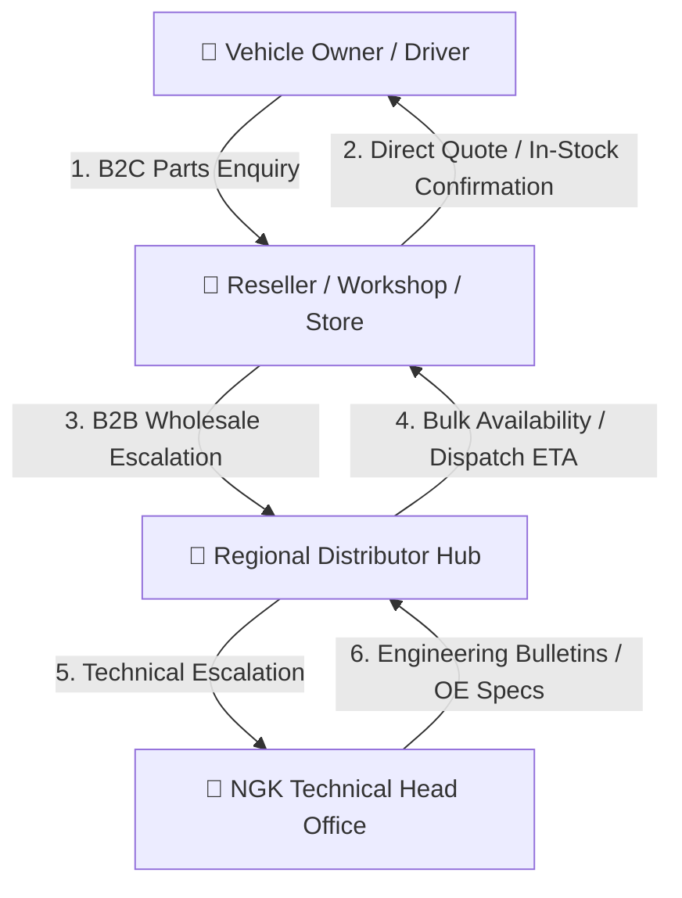
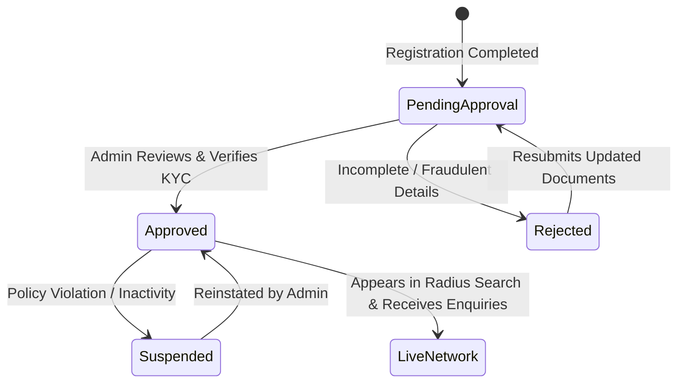
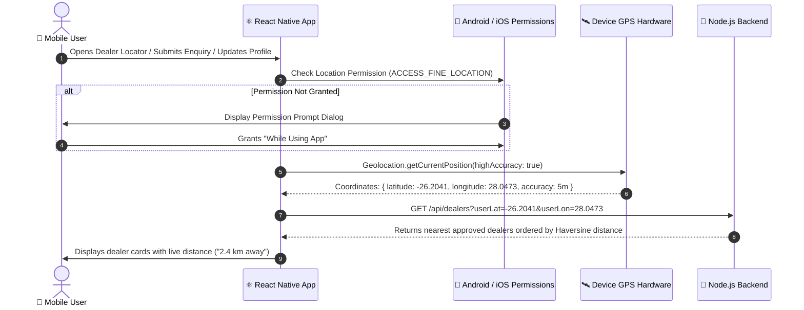
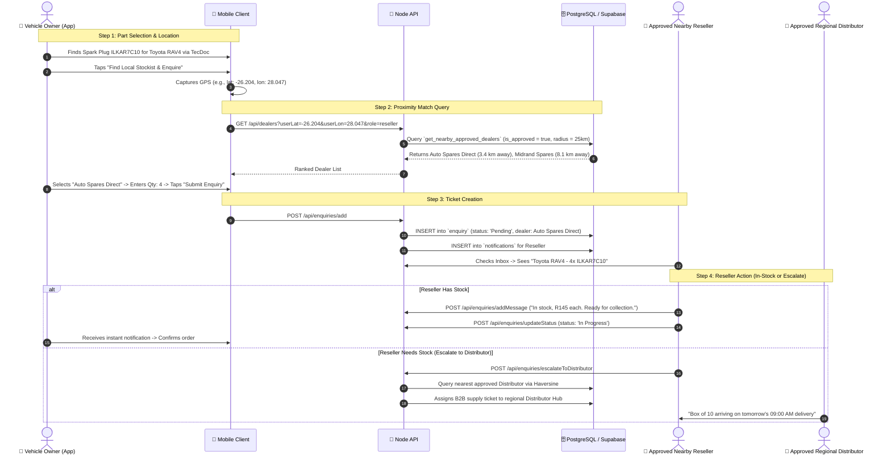

# 📑 NGK Parts Enquiry Platform: Domain Logic, Admin Approval & Geospatial Routing

## 1. Executive Summary & Philosophy: Parts Enquiry vs. Inventory Management

The NGK platform is deliberately architected as an **On-Demand Parts Availability & Technical Enquiry Platform**, **NOT an Inventory Management / Warehouse ERP System**.

### Why Not an Inventory Management System?
1. **Frictionless Onboarding**: Distributors, regional wholesalers, and independent workshop resellers already operate complex proprietary ERPs (e.g. SAP, Kerridge, CDK Global, Autopart, Sage). Requiring them to manually synchronize stock quantities, SKU bin counts, and warehouse ledgers into a separate mobile app guarantees immediate data staleness and user abandonment.
2. **Dynamic Aftermarket Reality**: In the automotive aftermarket, stock is fluid. A workshop or retail counter might sell 10 sets of spark plugs over the counter within minutes, or borrow parts from a neighboring partner store.
3. **The Real Value Proposition**:
   - **TecDoc Pegasus OE Accuracy**: The platform's primary power is identifying the exact right NGK / NTK part (spark plugs, glow plugs, ignition coils, lambda sensors) for any vehicle.
   - **Frictionless Sourcing & Quote Facilitation**: Once the correct part is identified, the customer or workshop instantly broadcasts a verified enquiry to nearby approved stockists who confirm live availability, turnaround time, and pricing in real time.

---

## 2. Distributor vs. Reseller Domain Logic



### A. The Reseller Domain (Workshops, Garages, Retail Auto Parts Stores)
* **Primary Role**: The retail front-line servicing local drivers and car owners.
* **Inbound Enquiries (B2C)**:
  * Receives parts availability enquiries from vehicle owners located within their immediate proximity (e.g., 5 km – 25 km radius).
  * Enquiry details contain: Vehicle Year/Make/Model/Engine, TecDoc Article Numbers (e.g. `ILKAR7C10`), Quantity required, and customer notes.
* **Reseller Responses**:
  * Responds with real-time status: **"In Stock"**, **"Available in 2 Hours"**, or **"Special Order"**.
  * Quotes unit pricing and optional fitting/installation cost.
* **Outbound Escalation (B2B)**:
  * When a Reseller receives an enquiry for a rare part or does not have stock on hand, they escalate the enquiry upstream to their nearest **Regional Distributor** with one click.

### B. The Distributor Domain (Tier-1 Regional Wholesale Hubs)
* **Primary Role**: Regional logistics and high-volume wholesale suppliers.
* **Inbound Enquiries (B2B)**:
  * Receives wholesale parts requests and stock replenishment enquiries from local Resellers and Workshops.
  * Direct enterprise enquiries routed by the platform for bulk fleet tenders or commercial accounts.
* **Distributor Responses**:
  * Confirms warehouse carton/box availability, trade discounts, delivery route schedules, or courier dispatch ETAs.
* **Technical Support Bridge**:
  * If a vehicle fitment is complex or has an unusual OEM supersession, the Distributor escalates the enquiry directly to NGK Head Office engineers via the admin channel.

---

## 3. Admin Approval Lifecycle: The Gatekeeper State Machine

To protect brand reputation, prevent spam, and ensure customers only interact with legitimate, verified automotive businesses, **Distributors and Resellers cannot be live until approved by the Admin Panel**.



### A. Account States & Status Lifecycle

| Status | `is_approved` | `is_live` | In-App Mobile Access | Geolocation Visibility | Enquiry Reception |
| :--- | :---: | :---: | :--- | :---: | :---: |
| **`pending_approval`** | `false` | `false` | Read-Only Dashboard with "Review Underway" banner | **Hidden** | **Blocked** |
| **`approved`** | `true` | `true` | Full Domain Access (Enquiry Inbox, Chat, Quotes) | **Visible** | **Active** |
| **`rejected`** | `false` | `false` | Displays Rejection Notice + Reason from Admin | **Hidden** | **Blocked** |
| **`suspended`** | `false` | `false` | Account Locked; Contact Support prompt | **Hidden** | **Blocked** |

### B. Database Schema Additions

```sql
-- 1. Extend Users table with Approval Lifecycle
ALTER TABLE public.users 
ADD COLUMN IF NOT EXISTS approval_status VARCHAR(50) DEFAULT 'pending_approval' 
    CHECK (approval_status IN ('pending_approval', 'approved', 'rejected', 'suspended')),
ADD COLUMN IF NOT EXISTS is_approved BOOLEAN DEFAULT FALSE,
ADD COLUMN IF NOT EXISTS approved_at TIMESTAMP WITH TIME ZONE,
ADD COLUMN IF NOT EXISTS approved_by UUID REFERENCES public.users(id),
ADD COLUMN IF NOT EXISTS rejection_reason TEXT;

-- 2. Extend Dealers table with Live status
ALTER TABLE public.dealers
ADD COLUMN IF NOT EXISTS is_live BOOLEAN DEFAULT FALSE,
ADD COLUMN IF NOT EXISTS trade_license_number VARCHAR(100),
ADD COLUMN IF NOT EXISTS vat_number VARCHAR(100);

-- 3. Composite Index for instant spatial querying of live stockists
CREATE INDEX IF NOT EXISTS idx_dealers_live_geo 
ON public.dealers(latitude, longitude) 
WHERE is_live = TRUE;
```

### C. Gatekeeping Rules in Application & Backend
1. **Spatial Directory Filter**:
   All spatial searches (`GET /api/dealers`) query **strictly** `WHERE is_live = TRUE` (or `users.is_approved = TRUE`). Unapproved businesses will never appear in customer search results or dealer locator maps.
2. **Enquiry Routing Guard**:
   When an enquiry is dispatched, the matching service filters candidate stockists by `d.is_live = true`.
3. **Mobile App Experience for Pending Resellers/Distributors**:
   - Resellers and Distributors logging in with `approval_status === 'pending_approval'` see a dedicated banner:
     > *"Your business profile is under review by NGK Automotive Administration. Live parts enquiry reception will be activated once your trade verification is complete."*
   - Enquiry inbox displays a clean placeholder preventing unapproved interactions.
4. **Admin Panel Verification Screen**:
   - Dedicated **"Dealer Approvals"** queue in the React admin portal.
   - Shows business name, contact person, phone, email, trade license, physical address, and GPS coordinates.
   - Action buttons:
     - **"Approve & Go Live"**: Sets `approval_status = 'approved'`, `is_approved = true`, `is_live = true`, and emits push notification to the reseller/distributor.
     - **"Reject"**: Prompts admin for rejection reason, sets `approval_status = 'rejected'`, and emails feedback to applicant.

---

## 4. Mobile Location Capture Architecture

Location capture runs natively on the mobile client using `@react-native-community/geolocation`.



### A. Native Permissions Configuration
* **Android (`android/app/src/main/AndroidManifest.xml`)**:
  ```xml
  <uses-permission android:name="android.permission.ACCESS_FINE_LOCATION" />
  <uses-permission android:name="android.permission.ACCESS_COARSE_LOCATION" />
  ```
* **iOS (`ios/ngk/Info.plist`)**:
  ```xml
  <key>NSLocationWhenInUseUsageDescription</key>
  <string>NGK requires your location to find authorized spark plug and ignition parts stockists near you.</string>
  ```

### B. Mobile Implementation Routine

```javascript
import Geolocation from '@react-native-community/geolocation';
import { PermissionsAndroid, Platform } from 'react-native';

export const acquireUserLocation = async () => {
  return new Promise(async (resolve, reject) => {
    try {
      if (Platform.OS === 'android') {
        const granted = await PermissionsAndroid.request(
          PermissionsAndroid.PERMISSIONS.ACCESS_FINE_LOCATION,
          {
            title: 'NGK Location Access',
            message: 'Enable location to discover authorized NGK stockists near your vehicle.',
            buttonPositive: 'Allow',
            buttonNegative: 'Cancel',
          }
        );
        if (granted !== PermissionsAndroid.RESULTS.GRANTED) {
          return reject(new Error('Location permission denied by user'));
        }
      }

      Geolocation.getCurrentPosition(
        (position) => {
          const { latitude, longitude, accuracy } = position.coords;
          resolve({ latitude, longitude, accuracy });
        },
        (error) => reject(error),
        {
          enableHighAccuracy: true,
          timeout: 15000,
          maximumAge: 10000,
        }
      );
    } catch (err) {
      reject(err);
    }
  });
};
```

---

## 5. The Haversine Formula: Mathematical Definition & Proximity Sorting

The **Haversine formula** calculates the great-circle distance between two points on the surface of a sphere using their latitudes and longitudes. It accounts for the spherical curvature of the Earth and is accurate to within 0.3% – 0.5% for terrestrial distances.

### A. Mathematical Derivation

Let:
* $(\phi_1, \lambda_1)$ = Latitude and Longitude of Point 1 (User / Requester) in radians
* $(\phi_2, \lambda_2)$ = Latitude and Longitude of Point 2 (Dealer / Stockist) in radians
* $R = 6,371\text{ km}$ = Mean spherical radius of the Earth

1. **Calculate the angular deltas in radians**:
   $$\Delta\phi = (\text{lat}_2 - \text{lat}_1) \times \frac{\pi}{180}$$
   $$\Delta\lambda = (\text{lon}_2 - \text{lon}_1) \times \frac{\pi}{180}$$

2. **Compute the Haversine function of the central angle $a$**:
   $$a = \sin^2\left(\frac{\Delta\phi}{2}\right) + \cos(\phi_1) \cdot \cos(\phi_2) \cdot \sin^2\left(\frac{\Delta\lambda}{2}\right)$$
   Where:
   * $\phi_1 = \text{lat}_1 \times \frac{\pi}{180}$
   * $\phi_2 = \text{lat}_2 \times \frac{\pi}{180}$

3. **Compute the angular distance $c$ in radians**:
   $$c = 2 \cdot \text{atan2}\left(\sqrt{a}, \sqrt{1 - a}\right)$$

4. **Multiply by Earth's radius to obtain distance $d$**:
   $$d = R \cdot c$$

---

### B. Backend Node.js Implementation (`dealer.service.js`)

```javascript
/**
 * Computes great-circle distance between two coordinates using Haversine formula
 * @param {number} lat1 - User Latitude (-90 to +90)
 * @param {number} lon1 - User Longitude (-180 to +180)
 * @param {number} lat2 - Dealer Latitude (-90 to +90)
 * @param {number} lon2 - Dealer Longitude (-180 to +180)
 * @returns {number} Distance in kilometers rounded to 1 decimal place
 */
calculateDistance(lat1, lon1, lat2, lon2) {
  const R = 6371; // Earth's mean radius in kilometers
  const toRad = (deg) => deg * (Math.PI / 180);

  const dLat = toRad(lat2 - lat1);
  const dLon = toRad(lon2 - lon1);

  const phi1 = toRad(lat1);
  const phi2 = toRad(lat2);

  const a =
    Math.sin(dLat / 2) * Math.sin(dLat / 2) +
    Math.cos(phi1) * Math.cos(phi2) *
    Math.sin(dLon / 2) * Math.sin(dLon / 2);

  const c = 2 * Math.atan2(Math.sqrt(a), Math.sqrt(1 - a));
  const distance = R * c;

  return parseFloat(distance.toFixed(1));
}
```

---

### C. Database-Level SQL Implementation (PostgreSQL / Supabase)

For ultra-high performance and large dealer networks, the distance calculation and filtering can be executed directly inside PostgreSQL using a stored procedure (RPC) or SQL query:

```sql
CREATE OR REPLACE FUNCTION get_nearby_approved_dealers(
    user_lat DOUBLE PRECISION,
    user_lon DOUBLE PRECISION,
    radius_km DOUBLE PRECISION DEFAULT 50.0,
    target_role VARCHAR DEFAULT NULL
)
RETURNS TABLE (
    id UUID,
    user_id UUID,
    company_name VARCHAR,
    street_address TEXT,
    city VARCHAR,
    postal_code VARCHAR,
    phone VARCHAR,
    contact_email VARCHAR,
    role VARCHAR,
    latitude DECIMAL,
    longitude DECIMAL,
    distance_km DOUBLE PRECISION
)
LANGUAGE sql
STABLE
AS $$
    SELECT 
        d.id,
        d.user_id,
        d.company_name,
        d.street_address,
        d.city,
        d.postal_code,
        d.phone,
        d.contact_email,
        u.role,
        d.latitude,
        d.longitude,
        ROUND(
            (6371 * acos(
                LEAST(1.0, GREATEST(-1.0,
                    cos(radians(user_lat)) * cos(radians(d.latitude)) * 
                    cos(radians(d.longitude) - radians(user_lon)) + 
                    sin(radians(user_lat)) * sin(radians(d.latitude))
                ))
            ))::numeric, 1
        )::DOUBLE PRECISION AS distance_km
    FROM public.dealers d
    JOIN public.users u ON u.id = d.user_id
    WHERE 
        u.is_approved = TRUE
        AND d.is_live = TRUE
        AND (target_role IS NULL OR u.role = target_role)
        -- Bounding Box optimization for indexed index pruning (~1 deg lat = 111 km)
        AND d.latitude BETWEEN (user_lat - (radius_km / 111.0)) AND (user_lat + (radius_km / 111.0))
        AND d.longitude BETWEEN (user_lon - (radius_km / (111.0 * cos(radians(user_lat))))) 
                            AND (user_lon + (radius_km / (111.0 * cos(radians(user_lat)))))
        -- Exact Haversine condition
        AND (6371 * acos(
                LEAST(1.0, GREATEST(-1.0,
                    cos(radians(user_lat)) * cos(radians(d.latitude)) * 
                    cos(radians(d.longitude) - radians(user_lon)) + 
                    sin(radians(user_lat)) * sin(radians(d.latitude))
                ))
            )) <= radius_km
    ORDER BY distance_km ASC;
$$;
```

---

## 6. End-to-End Enquiry Flow with Proximity Routing



---

## 7. Summary of Key Architectural Guardrails

1. **No Inventory Overhead**: Neither Resellers nor Distributors manage warehouse inventory tables in the app; they receive parts enquiries and respond with immediate availability.
2. **Strict Admin Verification**: Resellers and Distributors must pass Admin verification (`is_approved = true`, `is_live = true`) before receiving enquiries or appearing on maps.
3. **High-Accuracy Geolocation**: Native GPS capture provides coordinates to 4 decimal places (~11 meters precision), with fallbacks for manual city/postal search.
4. **Optimized Haversine Matching**: Calculates geodesic distance in kilometers, with spatial bounding box pruning for real-time responsiveness.
