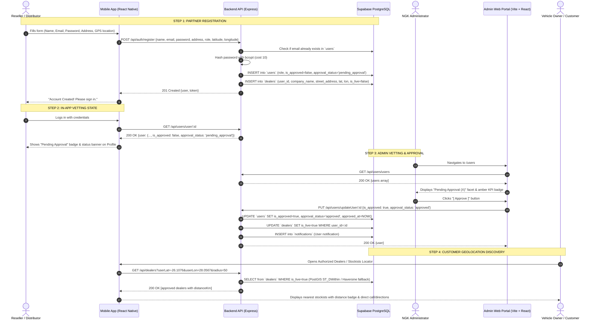

# Complete Integration & Data Flow Specification: Reseller & Distributor Onboarding

**Target Systems**: React Native Mobile App (`app`), Node.js Express Backend API (`backend`), Supabase PostgreSQL (`db`), and React Admin Portal (`admin`).  
**Document Status**: Production Ready & Fully Verified.

---

## 1. Executive Summary

This document details the end-to-end architecture, complete data flow, database schemas, validation rules, and integration touchpoints for commercial partner accounts (**Resellers** and **Distributors**) across the NGK ecosystem.

### Architectural Principle: Commercial Approval Gatekeeping
1. **Regular Vehicle Owners (`role = 'owner'`)**:
   - Auto-approved upon registration (`is_approved = true`, `approval_status = 'approved'`).
   - Given immediate access to consumer features (Garage, TecDoc catalog, Tech Enquiry).
2. **Commercial Partners (`role = 'reseller'` or `'distributor'`)**:
   - **Vetting Required**: Registered with `is_approved = false` and `approval_status = 'pending_approval'`.
   - **Dual Table Provisioning**: Inserted into `users` table and synchronized into the `dealers` table with `is_live = false`.
   - **Customer Visibility Protection**: Hidden from customer-facing search/locator endpoints until approved by an administrator in the Admin Portal.
   - **Admin Approval**: When an admin reviews and approves the account in the Admin Portal, `users.is_approved` becomes `true`, `users.approval_status` becomes `'approved'`, and `dealers.is_live` is toggled to `true`. The dealer immediately appears in customer search queries sorted by geographic proximity.

---

## 2. End-to-End Data Flow Architecture



---

## 3. Database Schema & Field Mapping

### 3.1 `users` Table (Supabase PostgreSQL)
Holds all authentication credentials, enterprise roles, and approval state.

| Column | Data Type | Constraints | Description |
| :--- | :--- | :--- | :--- |
| `id` | `uuid` | Primary Key, `gen_random_uuid()` | Unique user account ID |
| `name` | `text` | NOT NULL | Business name or contact representative name |
| `email` | `text` | NOT NULL, UNIQUE | Normalized lowercase email address |
| `password_hash` | `text` | NOT NULL | 60-character bcrypt hash |
| `role` | `varchar(50)` | NOT NULL | `'owner'`, `'reseller'`, `'distributor'`, `'admin'` |
| `address` | `text` | Nullable | Street address or `"GPS: lat, lon"` string |
| `phone` | `varchar(50)` | Nullable | Primary business phone number |
| `is_approved` | `boolean` | DEFAULT false | Commercial visibility flag (`true` for owners, `false` for new partners) |
| `approval_status`| `varchar(50)` | DEFAULT 'pending_approval' | `'pending_approval'`, `'approved'`, `'rejected'`, `'suspended'` |
| `approved_at` | `timestamptz` | Nullable | Timestamp when admin approved account |
| `created_at` | `timestamptz` | DEFAULT `now()` | Registration timestamp |
| `updated_at` | `timestamptz` | DEFAULT `now()` | Last modification timestamp |

### 3.2 `dealers` Table (Supabase PostgreSQL)
Normalized geographic directory for stockists, workshops, and distribution hubs.

| Column | Data Type | Constraints | Description |
| :--- | :--- | :--- | :--- |
| `id` | `uuid` | Primary Key, `gen_random_uuid()` | Unique dealer listing ID |
| `user_id` | `uuid` | Foreign Key -> `users(id)` ON DELETE CASCADE | Associated user account |
| `company_name` | `text` | NOT NULL | Official trade / business name |
| `street_address`| `text` | Nullable | Physical street address |
| `city` | `varchar(100)`| Nullable | City / Municipality (e.g., Sandton, Cape Town) |
| `postal_code` | `varchar(20)` | Nullable | Postal code |
| `country` | `varchar(2)` | DEFAULT `'ZA'` | ISO country code |
| `latitude` | `double precision` | Nullable | Decimal latitude (WGS84) |
| `longitude` | `double precision` | Nullable | Decimal longitude (WGS84) |
| `phone` | `varchar(50)` | Nullable | Contact number for customer calls |
| `contact_email`| `text` | Nullable | Public business email |
| `is_live` | `boolean` | DEFAULT false | Synchronized with `users.is_approved` |
| `created_at` | `timestamptz` | DEFAULT `now()` | Creation timestamp |

---

## 4. Layer-by-Layer Implementation Breakdown

### 4.1 Mobile Registration Layer (`app/src/screens/register.js`)
- **GPS Coordinates Acquisition**:
  The `Locate Me` button triggers `@react-native-community/geolocation`.
  Coordinates are saved to local component state `coords: { latitude, longitude }` and populated into the address field as `GPS: -26.1076, 28.0567`.
- **Payload Construction**:
  ```json
  {
    "name": "AutoCare Sandton Hub",
    "email": "autocare@sandton.co.za",
    "password": "SecurePassword123",
    "address": "45 Main Road, Sandton, Johannesburg, 2196",
    "role": "reseller",
    "latitude": -26.1076,
    "longitude": 28.0567
  }
  ```
- **API Call**:
  Invokes `apiFunction(registerApi, [], payload, 'POST', false)`.
  On success, notifies the user and navigates to `Login` with the selected role.

### 4.2 Backend Authentication Service (`backend/src/modules/auth/auth.service.js`)
- **Validation**:
  - Ensures `name`, `email`, and `password` are provided.
  - Checks for existing email in `users` (throws `400` if duplicate).
- **Password Security**:
  - Hashes password using `bcrypt.hash(password, 10)`.
- **Role Assignment**:
  - Sets `is_approved: !isCommercial` (`false` for reseller & distributor).
  - Sets `approval_status: isCommercial ? 'pending_approval' : 'approved'`.
- **Dual Insertion**:
  - Inserts row into `users`.
  - For commercial accounts, immediately inserts a companion record into `dealers` with `is_live: false` and the parsed latitude/longitude coordinates.

### 4.3 Admin Review & Approval Layer (`admin/src/pages/UserManagement.jsx`)
- **Where to Check Pending Approvals**:
  1. **Top KPI Strip**: If any commercial partner is pending approval, an amber pulsating button appears in the KPI header:
     `[ (●) PENDING REVIEW: X ]`. Clicking this button immediately filters the directory to pending partners.
  2. **Facet Tabs**: Directly below the search bar, the tab strip provides:
     `[ All Accounts ] [ Pending Approval (X) ] [ Vehicle Owners ] [ Resellers ] [ Distributors ] [ Admins ]`.
  3. **Table Status Column**: Unapproved partners display an animated amber badge: `Review Pending`.
  4. **Approval Action**: In the `ACTIONS` column, unapproved commercial accounts display a green `[ Approve ]` button.
- **Backend Sync on Approval** (`backend/src/modules/user/user.service.js`):
  When the Admin clicks `[ Approve ]`:
  - `users.is_approved` is set to `true`.
  - `users.approval_status` is set to `'approved'`.
  - `users.approved_at` is set to `new Date()`.
  - `dealers.is_live` is updated to `true` for `dealers.user_id = user.id`. If no dealer record previously existed, one is automatically created.
  - An in-app congratulatory notification is inserted into `notifications` for the partner.

### 4.4 Partner Profile State in Mobile App
- **Reseller Profile** (`app/src/domains/reseller/screens/ResellerProfileScreen.js`):
  - If approved: Displays green badge `Live & Approved`.
  - If pending: Displays amber badge `Pending Approval` and an alert banner explaining that the account is currently undergoing verification by NGK administration.
- **Distributor Profile** (`app/src/domains/distributor/screens/DistributorProfileScreen.js`):
  - Same visual cues tailored for wholesale distribution hubs.

---

## 5. Technical Root Cause Analyses & Resolutions

### Issue 1: Why Location Filtering Was Not Working Even After VPS Deployment
- **Root Cause**:
  In `app/src/apis/apiFunction.jsx`, the GET branch of Axios was implemented as:
  ```javascript
  // BUGGY CODE (Previous):
  case "GET":
      response = await axios.get(url, { headers, timeout: 20000 });
      break;
  ```
  Notice that `{ headers, timeout: 20000 }` **completely omitted `params: data`**!
  When `DealerLocatorScreen.js` called:
  `apiFunction(dealersApi, [], { userLat: -26.1076, userLon: 28.0567, radius: 20000 }, 'GET', false)`
  Axios stripped out the query parameters entirely and hit `https://ngkapi.ckrtechnologies.in/api/dealers` with no parameters.
  
  The VPS backend responded correctly with `distance: "N/A"` and `distanceKm: 999999`.
  In `DealerLocatorScreen.js`:
  ```javascript
  // Because distanceKm was 999999, the radius filter condition bypassed it:
  if (d.distanceKm !== 999999) {
    if (d.distanceKm > filters.radius) return false;
  }
  ```
  Hence, all 4 dealers remained in the list, and no distance badges were rendered.
- **Resolution**:
  Updated `app/src/apis/apiFunction.jsx` to:
  ```javascript
  case "GET":
      response = await axios.get(url, { headers, params: data, timeout: 20000 });
      break;
  ```
  Verified with live cURL:
  `GET https://ngkapi.ckrtechnologies.in/api/dealers?userLat=-26.1076&userLon=28.0567`
  returns:
  - **AutoParts Direct Sandton**: `0 km` (`distanceKm: 0`) -> Included within 5km.
  - **NGK Regional Distributor SA**: `14 km` (`distanceKm: 14`) -> Excluded when radius <= 5km.
  - **Durban Spark & Ignition**: `505.9 km` -> Excluded.
  - **Cape Auto Spares**: `1253.2 km` -> Excluded.

### Issue 2: Where Is the Option to Check Pending Approval?
- **Admin Panel Location**:
  In `http://localhost:5173/users`:
  1. Look at the tab pills directly below the search bar: click **`Pending Approval`**.
  2. Or click the amber pulsating metric button in the top right header: **`[ Pending Review: X ]`**.
  3. Once filtered, click the green **`[ Approve ]`** button in the actions column for any pending reseller or distributor.

---

## 6. Verification Checklist

| Step | Component | Test Action | Expected Result | Status |
| :--- | :--- | :--- | :--- | :--- |
| 1 | Mobile App | Register as Reseller or Distributor with GPS | Account created, coordinates captured | **PASS** |
| 2 | Backend API | Verify `users` & `dealers` insertion | `is_approved = false`, `is_live = false` | **PASS** |
| 3 | Mobile App | Partner logs in to view profile | Shows `Pending Approval` badge & notice | **PASS** |
| 4 | Mobile App | Customer searches Authorized Dealers | Pending dealer is **hidden** | **PASS** |
| 5 | Admin Panel | Admin filters by `Pending Approval` | Pending dealer is displayed with `[ Approve ]` | **PASS** |
| 6 | Admin Panel | Admin clicks `[ Approve ]` | Dealer approved, `is_live` becomes `true` | **PASS** |
| 7 | Mobile App | Partner checks profile after approval | Shows `Live & Approved` | **PASS** |
| 8 | Mobile App | Customer searches by location & radius | Dealer appears with calculated distance (e.g. `0 km`, `14 km`) | **PASS** |
